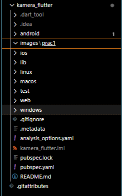
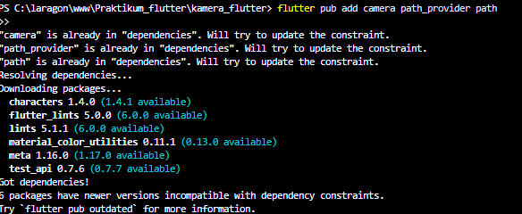
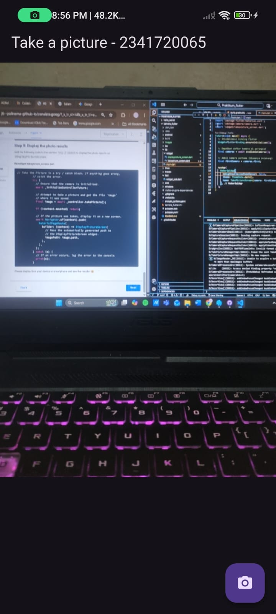
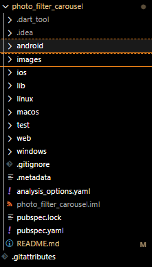
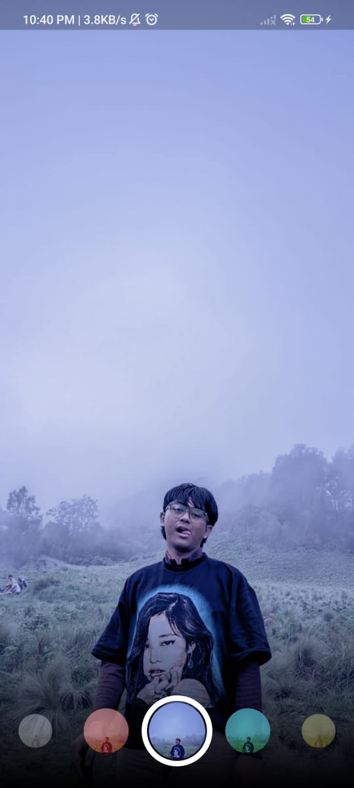
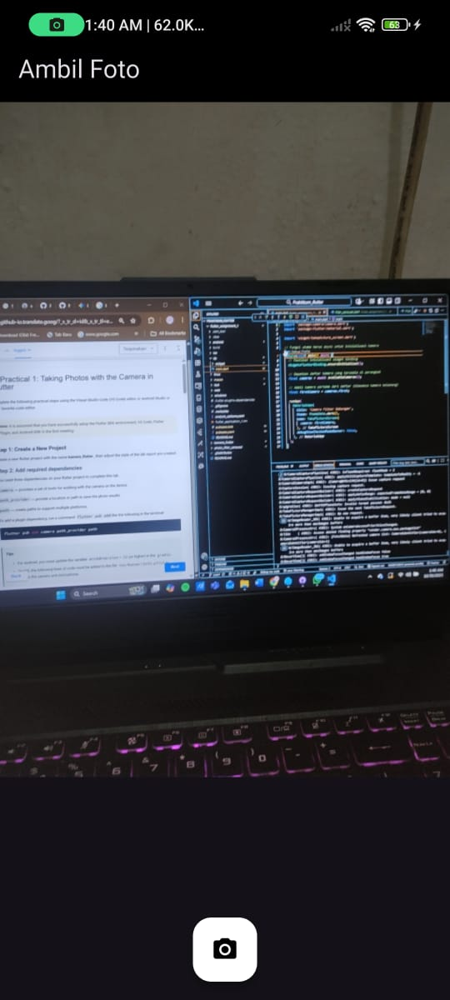
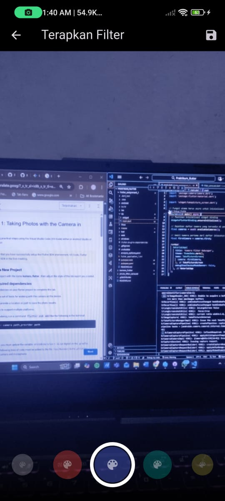

# kamera_flutter - Lab 1

A new Flutter project.

## Step 1: Create a New Project
Create a new flutter project with the name kamera_flutter , then adjust the style of the lab report you created.


## Step 2: Add required dependencies
You need three dependencies on your flutter project to complete this lab.

camera→ provides a set of tools for working with the camera on the device.

path_provider→ provide a location or path to save the photo results.

path→ create paths to support multiple platforms.

To add a plugin dependency, run a command flutter pub addlike the following in the terminal:



## Step 3: Remove the Camera Sensor from the device
Next, we need to check the number of cameras available on the device using a plugin cameralike the one in the following code. Place this code inside void main().
```dart:
import 'package:flutter/material.dart';
import 'package:camera/camera.dart';
import 'widget/takepicture_screen.dart';

Future<void> main() async {
  // Inisialisasi binding Flutter
  WidgetsFlutterBinding.ensureInitialized();

  // Dapatkan daftar kamera di perangkat
  final cameras = await availableCameras();

  // Ambil kamera pertama (biasanya belakang)
  final firstCamera = cameras.first;

  runApp(
    MaterialApp(
      debugShowCheckedModeBanner: false,
      theme: ThemeData.dark(),
      home: TakePictureScreen(camera: firstCamera),
    ),
  );
}
```
## Step 4: Create and initializeCameraController
Once you have access to the camera, use the following steps to create and initialize it CameraController. In the following steps, you will create a connection to the device's camera, allowing you to control the camera and preview the camera feed.

1. Create StatefulWidgetwith Statecompanion class.
2. Add a variable to the class Stateto store CameraController.
3. Add a variable to the class Stateto store Futurethe returned from CameraController.initialize().
4. Create and initialize the controller in the initState().
5. Remove the controller in the method dispose().
```dart:
import 'package:flutter/material.dart';
import 'package:camera/camera.dart';

class TakePictureScreen extends StatefulWidget {
  const TakePictureScreen({
    super.key,
    required this.camera,
  });

  final CameraDescription camera;

  @override
  TakePictureScreenState createState() => TakePictureScreenState();
}

class TakePictureScreenState extends State<TakePictureScreen> {
  late CameraController _controller;
  late Future<void> _initializeControllerFuture;

  @override
  void initState() {
    super.initState();
    _controller = CameraController(
      widget.camera,
      ResolutionPreset.medium,
    );
    _initializeControllerFuture = _controller.initialize();
  }

  @override
  void dispose() {
    _controller.dispose();
    super.dispose();
  }

  @override
  Widget build(BuildContext context) {
    return const Scaffold(
      body: Center(
        child: Text('Camera not initialized yet'),
      ),
    );
  }
}
```

## Step 5: Use CameraPreview to display a preview of the photo
Use a widget CameraPreviewfrom the package camerato display a photo preview. You'll need a void object type FutureBuilderto handle async processes.
```dart:
import 'package:flutter/material.dart';
import 'package:camera/camera.dart';

class TakePictureScreen extends StatefulWidget {
  const TakePictureScreen({super.key, required this.camera});

  final CameraDescription camera;

  @override
  TakePictureScreenState createState() => TakePictureScreenState();
}

class TakePictureScreenState extends State<TakePictureScreen> {
  late CameraController _controller;
  late Future<void> _initializeControllerFuture;

  @override
  void initState() {
    super.initState();
    _controller = CameraController(widget.camera, ResolutionPreset.medium);
    _initializeControllerFuture = _controller.initialize();
  }

  @override
  void dispose() {
    _controller.dispose();
    super.dispose();
  }

  @override
  Widget build(BuildContext context) {
    return Scaffold(
      appBar: AppBar(title: const Text('Take a picture - 2341720065')),
      body: FutureBuilder<void>(
        future: _initializeControllerFuture,
        builder: (context, snapshot) {
          if (snapshot.connectionState == ConnectionState.done) {
            return CameraPreview(_controller);
          } else {
            return const Center(child: CircularProgressIndicator());
          }
        },
      ),
    );
  }
}
```

## Step 6: Take a photo withCameraController
You can use CameraControllerto retrieve an image using the takePicture(), which returns an object XFile, which is a simplified cross-platform abstraction object File. On Android and iOS, new images are stored in their respective cache directories, and pathare returned to that location in XFile.

In this codelab, create a FloatingActionButtonfunction that takes a picture CameraControllerwhen the user taps a button.

Taking pictures requires 2 steps:

1. Make sure the camera has been initialized.
2. Use the controller to take a picture and make sure it returns an object .Future

It is good practice to wrap these code operations in blocks try / catchto handle any errors that may occur.

The following code is placed Widget buildafter the field body.

```dart:
import 'package:flutter/material.dart';
import 'package:camera/camera.dart';
import 'displaypicture_screen.dart';
import 'dart:io';

class TakePictureScreen extends StatefulWidget {
  const TakePictureScreen({
    super.key,
    required this.camera,
  });

  final CameraDescription camera;

  @override
  TakePictureScreenState createState() => TakePictureScreenState();
}

class TakePictureScreenState extends State<TakePictureScreen> {
  late CameraController _controller;
  late Future<void> _initializeControllerFuture;

  @override
  void initState() {
    super.initState();
    _controller = CameraController(
      widget.camera,
      ResolutionPreset.medium,
    );
    _initializeControllerFuture = _controller.initialize();
  }

  @override
  void dispose() {
    _controller.dispose();
    super.dispose();
  }

  @override
  Widget build(BuildContext context) {
    return Scaffold(
      appBar: AppBar(title: const Text('Take a picture - 2341720065')),

      // 🔹 BAGIAN BODY — menampilkan preview kamera
      body: FutureBuilder<void>(
        future: _initializeControllerFuture,
        builder: (context, snapshot) {
          if (snapshot.connectionState == ConnectionState.done) {
            return CameraPreview(_controller);
          } else {
            return const Center(child: CircularProgressIndicator());
          }
        },
      ),

      // 🔹 BAGIAN FLOATING ACTION BUTTON — Step 6 diletakkan DI SINI
      floatingActionButton: FloatingActionButton(
        onPressed: () async {
          try {
            // Pastikan kamera sudah siap
            await _initializeControllerFuture;

            // Ambil gambar
            final image = await _controller.takePicture();

            // Tampilkan path file di console
            print('Gambar disimpan di: ${image.path}');
          } catch (e) {
            print('Terjadi kesalahan: $e');
          }
        },
        child: const Icon(Icons.camera_alt),
      ),
    );
  }
}
```

## Step 7: Create a new widgetDisplayPictureScreen
Create a new file in the widget folder containing the following code.

lib/widget/displaypicture_screen.dart
```dart:
import 'package:flutter/material.dart';
import 'dart:io';

class DisplayPictureScreen extends StatelessWidget {
  final String imagePath;

  const DisplayPictureScreen({super.key, required this.imagePath});

  @override
  Widget build(BuildContext context) {
    return Scaffold(
      appBar: AppBar(title: const Text('Display the Picture - 2341720065')),
      body: Image.file(File(imagePath)),
    );
  }
}
```

## Step 8: Editmain.dart
Edit in this file the section runApplike the following code.

lib/main.dart
```dart:
import 'package:flutter/material.dart';
import 'package:camera/camera.dart';
import 'widget/takepicture_screen.dart';

Future<void> main() async {
  // Inisialisasi binding Flutter
  WidgetsFlutterBinding.ensureInitialized();

  // Dapatkan daftar kamera di perangkat
  final cameras = await availableCameras();

  // Ambil kamera pertama (biasanya belakang)
  final firstCamera = cameras.first;

  runApp(
    MaterialApp(
      debugShowCheckedModeBanner: false,
      theme: ThemeData.dark(),
      home: TakePictureScreen(camera: firstCamera),
    ),
  );
}
```

## Step 9: Display the photo results
Add the following code to the section try / catchto display the photo results on DisplayPictureScreen.

lib/widget/takepicture_screen.dart

```dart:
import 'package:flutter/material.dart';
import 'package:camera/camera.dart';
import 'displaypicture_screen.dart';
import 'dart:io';

/// A screen that allows users to take a picture using a given camera.
class TakePictureScreen extends StatefulWidget {
  const TakePictureScreen({
    super.key,
    required this.camera,
  });

  final CameraDescription camera;

  @override
  TakePictureScreenState createState() => TakePictureScreenState();
}

class TakePictureScreenState extends State<TakePictureScreen> {
  late CameraController _controller;
  late Future<void> _initializeControllerFuture;

  @override
  void initState() {
    super.initState();
    // Inisialisasi kamera
    _controller = CameraController(
      widget.camera,
      ResolutionPreset.medium,
    );
    _initializeControllerFuture = _controller.initialize();
  }

  @override
  void dispose() {
    // Tutup kamera saat widget dihapus
    _controller.dispose();
    super.dispose();
  }

  @override
  Widget build(BuildContext context) {
    return Scaffold(
      appBar: AppBar(title: const Text('Take a picture - 2341720065')),

      // Menampilkan preview kamera
      body: FutureBuilder<void>(
        future: _initializeControllerFuture,
        builder: (context, snapshot) {
          if (snapshot.connectionState == ConnectionState.done) {
            // Jika kamera sudah siap, tampilkan preview
            return CameraPreview(_controller);
          } else {
            // Jika belum, tampilkan indikator loading
            return const Center(child: CircularProgressIndicator());
          }
        },
      ),

      // Tombol kamera untuk mengambil gambar
      floatingActionButton: FloatingActionButton(
        onPressed: () async {
          try {
            // Pastikan kamera sudah siap
            await _initializeControllerFuture;

            // Ambil gambar
            final image = await _controller.takePicture();

            // Pastikan context masih aktif sebelum pindah halaman
            if (!context.mounted) return;

            // Navigasi ke halaman DisplayPictureScreen dan tampilkan hasil foto
            await Navigator.of(context).push(
              MaterialPageRoute(
                builder: (context) => DisplayPictureScreen(
                  imagePath: image.path,
                ),
              ),
            );
          } catch (e) {
            // Tangani error jika ada
            print('Terjadi kesalahan saat mengambil gambar: $e');
          }
        },
        child: const Icon(Icons.camera_alt),
      ),
    );
  }
}
```
RESULT:


# photo_filter_carousel - Lab 2

A new Flutter project.

## Step 1: Create a new project
Create a new flutter project in meeting 09 with the name photo_filter_carousel


## Step 2: Create a Selector ring and dark gradient widget
Create a widgetnew folder and file containing the following code.

lib/widget/filter_selector.dart
```dart:
import 'package:flutter/material.dart';
import 'package:flutter/rendering.dart'; 

import 'carousel_flowdelegate.dart';
import 'filter_item.dart';

@immutable
class FilterSelector extends StatefulWidget {
  const FilterSelector({
    super.key,
    required this.filters,
    required this.onFilterChanged,
    this.padding = const EdgeInsets.symmetric(vertical: 24),
  });

  final List<Color> filters;
  final void Function(Color selectedColor) onFilterChanged;
  final EdgeInsets padding;

  @override
  State<FilterSelector> createState() => _FilterSelectorState();
}

class _FilterSelectorState extends State<FilterSelector> {
  static const _filtersPerScreen = 5;
  static const _viewportFractionPerItem = 1.0 / _filtersPerScreen;

  late final PageController _controller;
  late int _page;

  int get filterCount => widget.filters.length;

  Color itemColor(int index) => widget.filters[index % filterCount];

  @override
  void initState() {
    super.initState();
    _page = 0;
    _controller = PageController(
      initialPage: _page,
      viewportFraction: _viewportFractionPerItem,
    );
    _controller.addListener(_onPageChanged);
  }

  void _onPageChanged() {
    final page = (_controller.page ?? 0).round();
    if (page != _page) {
      _page = page;
      widget.onFilterChanged(widget.filters[page % filterCount]); 
    }
  }

  void _onFilterTapped(int index) {
    _controller.animateToPage(
      index,
      duration: const Duration(milliseconds: 450),
      curve: Curves.ease,
    );
  }

  @override
  void dispose() {
    _controller.dispose();
    super.dispose();
  }

  @override
  Widget build(BuildContext context) {
    return Scrollable(
      controller: _controller,
      axisDirection: AxisDirection.right,
      physics: const PageScrollPhysics(),
      viewportBuilder: (context, viewportOffset) {
        return LayoutBuilder(
          builder: (context, constraints) {
            final itemSize = constraints.maxWidth * _viewportFractionPerItem;
            // Penting: Mengaplikasikan dimensi viewport dan konten ke offset
            viewportOffset
              ..applyViewportDimension(constraints.maxWidth)
              ..applyContentDimensions(0.0, itemSize * (filterCount - 1));

            return Stack(
              alignment: Alignment.bottomCenter,
              children: [
                _buildShadowGradient(itemSize),
                _buildCarousel(
                  viewportOffset: viewportOffset,
                  itemSize: itemSize,
                ),
                _buildSelectionRing(itemSize),
              ],
            );
          },
        );
      },
    );
  }

  Widget _buildShadowGradient(double itemSize) {
    return SizedBox(
      height: itemSize * 2 + widget.padding.vertical,
      child: const DecoratedBox(
        decoration: BoxDecoration(
          gradient: LinearGradient(
            begin: Alignment.topCenter,
            end: Alignment.bottomCenter,
            colors: [
              Colors.transparent,
              Colors.black,
            ],
          ),
        ),
        child: SizedBox.expand(),
      ),
    );
  }

  Widget _buildCarousel({
    required ViewportOffset viewportOffset,
    required double itemSize,
  }) {
    return Container(
      height: itemSize,
      margin: widget.padding,
      child: Flow(
        // Meneruskan ViewportOffset ke delegate
        delegate: CarouselFlowDelegate(
          viewportOffset: viewportOffset,
          filtersPerScreen: _filtersPerScreen,
        ),
        children: [
          for (int i = 0; i < filterCount; i++)
            FilterItem(
              onFilterSelected: () => _onFilterTapped(i),
              color: itemColor(i),
            ),
        ],
      ),
    );
  }

  Widget _buildSelectionRing(double itemSize) {
    return IgnorePointer(
      child: Padding(
        padding: widget.padding,
        child: SizedBox(
          width: itemSize,
          height: itemSize,
          child: const DecoratedBox(
            decoration: BoxDecoration(
              shape: BoxShape.circle,
              border: Border.fromBorderSide(
                BorderSide(width: 6, color: Colors.white),
              ),
            ),
          ),
        ),
      ),
    );
  }
}

```

## Step 3: Create a photo filter carousel widget
Create a new file in the widget folder with code like the following.

lib/widget/filter_carousel.dart
```dart:
import 'package:flutter/material.dart';
import 'filter_selector.dart';

@immutable
class PhotoFilterCarousel extends StatefulWidget {
  const PhotoFilterCarousel({super.key});

  @override
  State<PhotoFilterCarousel> createState() => _PhotoFilterCarouselState();
}

class _PhotoFilterCarouselState extends State<PhotoFilterCarousel> {
  final _filters = [
    Colors.white,
    ...List.generate(
      Colors.primaries.length,
      (index) => Colors.primaries[(index * 4) % Colors.primaries.length],
    )
  ];

  final _filterColor = ValueNotifier<Color>(Colors.white);

  void _onFilterChanged(Color value) {
    _filterColor.value = value;
  }

  @override
  Widget build(BuildContext context) {
    return Material(
      color: Colors.black,
      child: Stack(
        children: [
          // Gambar utama dengan efek filter warna
          Positioned.fill(
            child: _buildPhotoWithFilter(),
          ),
          // Carousel filter di bagian bawah layar
          Positioned(
            left: 0.0,
            right: 0.0,
            bottom: 0.0,
            child: _buildFilterSelector(),
          ),
        ],
      ),
    );
  }

  Widget _buildPhotoWithFilter() {
    return ValueListenableBuilder(
      valueListenable: _filterColor,
      builder: (context, color, child) {
        // MENGGUNAKAN GAMBAR LOKAL: img1.jpg
        return Image.asset(
          'assets/images/img1.jpg', 
          color: color.withOpacity(0.5),
          colorBlendMode: BlendMode.color,
          fit: BoxFit.cover,
        );
      },
    );
  }

  Widget _buildFilterSelector() {
    return FilterSelector(
      onFilterChanged: _onFilterChanged,
      filters: _filters,
    );
  }
}
```

## Step 4: Creating a color filter - part 1
Create a new file in the widget folder like the following code.

lib/widget/carousel_flowdelegate.dart

```dart:
import 'package:flutter/material.dart';
import 'dart:math' as math;

import 'package:flutter/rendering.dart';

class CarouselFlowDelegate extends FlowDelegate {
  CarouselFlowDelegate({
    required this.viewportOffset,
    required this.filtersPerScreen,
  }) : super(repaint: viewportOffset); 

  final ViewportOffset viewportOffset;
  final int filtersPerScreen;

  @override
  void paintChildren(FlowPaintingContext context) {
    final count = context.childCount;
    final size = context.size.width;
    final itemExtent = size / filtersPerScreen;

    // Akses posisi scroll dari ViewportOffset
    final active = viewportOffset.pixels / itemExtent; 

    final min = math.max(0, active.floor() - 3).toInt();
    final max = math.min(count - 1, active.ceil() + 3).toInt();

    for (var index = min; index <= max; index++) {
      final itemXFromCenter = itemExtent * index - viewportOffset.pixels; 
      final percentFromCenter = 1.0 - (itemXFromCenter / (size / 2)).abs();
      final itemScale = 0.5 + (percentFromCenter * 0.5);
      final opacity = 0.25 + (percentFromCenter * 0.75);

      final itemTransform = Matrix4.identity()
        ..translate((size - itemExtent) / 2)
        ..translate(itemXFromCenter)
        ..translate(itemExtent / 2, itemExtent / 2)
        ..multiply(Matrix4.diagonal3Values(itemScale, itemScale, 1.0))
        ..translate(-itemExtent / 2, -itemExtent / 2);

      context.paintChild(
        index,
        transform: itemTransform,
        opacity: opacity,
      );
    }
  }

  @override
  bool shouldRepaint(covariant CarouselFlowDelegate oldDelegate) {
    return oldDelegate.viewportOffset != viewportOffset;
  }
}
```
## Step 5: Creating a color filter
Create a new file in the widget folder like the following code.

lib/widget/filter_item.dart
```dart:
import 'package:flutter/material.dart';

@immutable
class FilterItem extends StatelessWidget {
  const FilterItem({
    super.key,
    required this.color,
    this.onFilterSelected,
  });

  final Color color;
  final VoidCallback? onFilterSelected;

  @override
  Widget build(BuildContext context) {
    return GestureDetector(
      onTap: onFilterSelected,
      child: AspectRatio(
        aspectRatio: 1.0,
        child: Padding(
          padding: const EdgeInsets.all(8),
          child: ClipOval(
            child: Image.asset(
              'assets/images/img1.jpg', // MENGGUNAKAN FOTO YANG SAMA SEBAGAI TEKSTUR
              color: color.withOpacity(0.5),
              colorBlendMode: BlendMode.hardLight,
              fit: BoxFit.cover, // Pastikan fit disetel agar terlihat bagus di ClipOval
            ),
          ),
        ),
      ),
    );
  }
}
```
Step 6: Implement the carousel filter
Finally, we import the widget PhotoFilterCarouselinto mainlike the following code.

lib/main.dart

```dart:
import 'package:flutter/material.dart';
import 'widget/filter_carousel.dart';

void main() {
  runApp(
    const MaterialApp(
      home: PhotoFilterCarousel(),
      debugShowCheckedModeBanner: false,
    ),
  );
}
```

Result:


# 5. Practical Assignments
1. Complete Practicals 1 and 2, then document and upload screenshots of each work result along with explanations in a file README.md! If there are any errors or code that doesn't work, please correct them according to the application's purpose!

- i have done yet


2. Combine the results of lab 1 with the results of lab 2 so that after taking the photo, you can create a carousel filter!

the code:

- main.dart:
[text](flutter_assignment_1/lib/main.dart)

- carousel_flowdelegate:
[text](flutter_assignment_1/lib/widget/carousel_flowdelegate.dart)

- filter_carousel.dart
[text](flutter_assignment_1/lib/widget/filter_carousel.dart)

- filter_item.dart
[text](flutter_assignment_1/lib/widget/filter_item.dart)

- filter_selector.dart
[text](flutter_assignment_1/lib/widget/filter_selector.dart)

- takepicture_screen.dart
[text](flutter_assignment_1/lib/widget/takepicture_screen.dart)

- Result:
1:


2:


3. Explain the purpose void asyncof practical 1?

- The primary purpose of using the async keyword on a function (e.g., void async _takePicture()) is to enable asynchronous operation.

1. I/O Operations: Taking a picture (await _controller.takePicture()) is an I/O operation that involves device hardware (the camera) and disk storage. Such operations inherently take time.

2. Non-Blocking: By marking the function as async, the await keyword can be used. This tells the program to pause execution within this function only, waiting for the camera operation to complete, but crucially, it releases the main UI thread.

3. Result: This ensures the application remains responsive; the user interface does not freeze while waiting for the picture to be processed, which is essential for a good user experience.

4. Explain the function of annotation @immutableand @override?
 - The @immutable Annotation

The @immutable annotation is used to declare that the annotated class and all of its public fields cannot be changed after the object has been created (constructed). In Flutter, this is particularly important for Widget classes (especially StatelessWidget) because it communicates to the framework and to other developers that all properties within the class are final. By ensuring a widget is immutable, you improve the code's predictability and stability, as it prevents unexpected state changes. This immutability also helps the Flutter framework optimize its internal processes, such as determining when a widget needs to be rebuilt.

- The @override Annotation

The @override annotation signals that a method (function) within a subclass is intended to replace or modify an existing method with the exact same name and signature inherited from its parent class or interface. Its primary function is a safety and clarity feature. If you mistakenly change the name or parameters of the method in the subclass (or if the method name in the superclass changes), the Dart compiler will immediately throw a compile-time error. This prevents subtle bugs that might only appear during runtime and significantly enhances code readability by clearly indicating which methods are being inherited and customized.

5. Submit your GitHub repository commit link to the agreed lecturer!