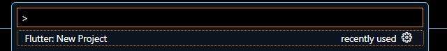
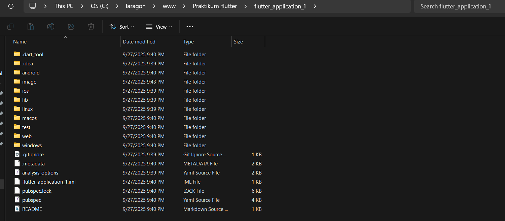
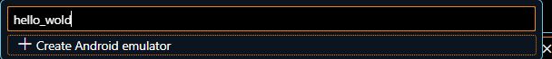
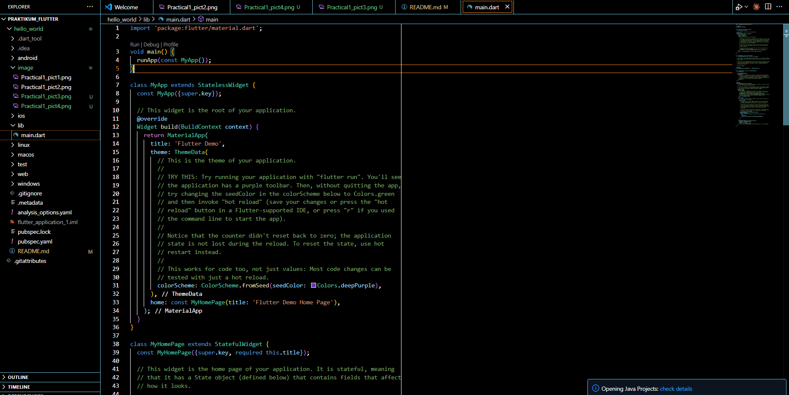

# Jobsheet 5

Name : Agna Putra Prawira
NIM : 2341720065
Absent: 01

## Practical 1

### Step 1

This step is a quick way to access all available commands in VS Code, including those added by the Flutter extension.

1. Open the Visual Studio Code application.

2. Press the keys Ctrl + Shift + P simultaneously.

3. A search box will appear at the top of the screen. Type Flutter.

4. From the list that appears, click on the option Flutter: New Application Project.

Explanation: The Command Palette is like a "command center" in VS Code. Instead of hunting through menus, you can directly type any command you need. The Flutter: New Application Project command comes from the Flutter extension and is designed to create the entire basic folder and file structure needed for a Flutter app.

### Step 2: Select the Project Location

Now, Flutter needs to know where you want to save all the files for this new project.

1. After selecting "New Application Project", a file explorer window will open.

2. Navigate to the location where you usually save your coursework, for example, Documents/Practicals or another easy-to-find folder.

3. Do not enter an existing project folder. Simply select the "parent" folder where your new project will be created.

4. Click the "Select a folder to create the project in" button.

Explanation: 📁 It's good practice to choose a neat and not-too-deep file path (e.g., C:\Users\YourName\Documents\…) to avoid potential issues with long path names, which can sometimes cause errors on certain operating systems.

### Step 3: Name Your Project
Every project needs a unique name as an identifier.

After selecting the folder, VS Code will prompt you to enter a project name.

Type hello_world and press Enter.

Important Rules for Project Names:

Use only lowercase letters.

Use underscores (_) instead of spaces.

The name cannot start with a number or a special character.

Explanation: 📝 These naming rules are mandatory because the project name is also used as the package name in the Dart/Flutter ecosystem. After you press Enter, Flutter will start working in the background, creating the hello_world folder and populating it with all the necessary template files. This process might take a few seconds to a minute.

### Step 4: Project Successfully Created
If all steps were done correctly, VS Code will open a new window containing your complete Flutter project.

You will see:

The project's folder structure in the panel on the left (containing folders like lib, android, ios, etc.).

The lib/main.dart file will be automatically opened in the main editor.

A success message will appear in the bottom-right corner.

Explanation: ✅ Congratulations! You have successfully created your first Flutter project. The main.dart file inside the lib folder is the starting point of your application. This is where the code for the default demo app (a simple counter app) is located.

## Practical 2: Connecting an Android Device or Emulator

Continuing from lab 1, you'll be asked to run the application on a physical device (Android or iOS). Please follow the steps in the codelab linked below.

https://developer.android.com/codelabs/basic-android-kotlin-compose-connect-device?hl=en#0

Back
Next
