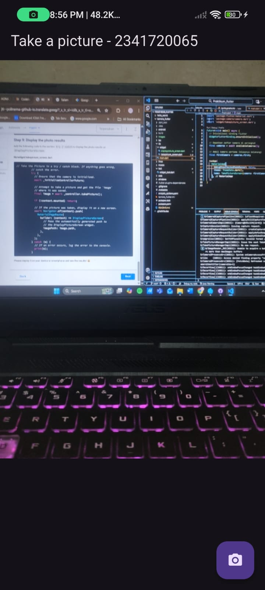

# kamera_flutter

A new Flutter project.

## Step 1: Create a New Project
Create a new flutter project with the name kamera_flutter , then adjust the style of the lab report you created.


## Step 2: Add required dependencies
You need three dependencies on your flutter project to complete this lab.

camera→ provides a set of tools for working with the camera on the device.

path_provider→ provide a location or path to save the photo results.

path→ create paths to support multiple platforms.

To add a plugin dependency, run a command flutter pub addlike the following in the terminal:


## Step 3: Remove the Camera Sensor from the device
Next, we need to check the number of cameras available on the device using a plugin cameralike the one in the following code. Place this code inside void main().
```dart:
import 'package:flutter/material.dart';
import 'package:camera/camera.dart';
import 'widget/takepicture_screen.dart';

Future<void> main() async {
  // Inisialisasi binding Flutter
  WidgetsFlutterBinding.ensureInitialized();

  // Dapatkan daftar kamera di perangkat
  final cameras = await availableCameras();

  // Ambil kamera pertama (biasanya belakang)
  final firstCamera = cameras.first;

  runApp(
    MaterialApp(
      debugShowCheckedModeBanner: false,
      theme: ThemeData.dark(),
      home: TakePictureScreen(camera: firstCamera),
    ),
  );
}
```
## Step 4: Create and initializeCameraController
Once you have access to the camera, use the following steps to create and initialize it CameraController. In the following steps, you will create a connection to the device's camera, allowing you to control the camera and preview the camera feed.

1. Create StatefulWidgetwith Statecompanion class.
2. Add a variable to the class Stateto store CameraController.
3. Add a variable to the class Stateto store Futurethe returned from CameraController.initialize().
4. Create and initialize the controller in the initState().
5. Remove the controller in the method dispose().
```dart:
import 'package:flutter/material.dart';
import 'package:camera/camera.dart';

class TakePictureScreen extends StatefulWidget {
  const TakePictureScreen({
    super.key,
    required this.camera,
  });

  final CameraDescription camera;

  @override
  TakePictureScreenState createState() => TakePictureScreenState();
}

class TakePictureScreenState extends State<TakePictureScreen> {
  late CameraController _controller;
  late Future<void> _initializeControllerFuture;

  @override
  void initState() {
    super.initState();
    _controller = CameraController(
      widget.camera,
      ResolutionPreset.medium,
    );
    _initializeControllerFuture = _controller.initialize();
  }

  @override
  void dispose() {
    _controller.dispose();
    super.dispose();
  }

  @override
  Widget build(BuildContext context) {
    return const Scaffold(
      body: Center(
        child: Text('Camera not initialized yet'),
      ),
    );
  }
}
```

## Step 5: Use CameraPreview to display a preview of the photo
Use a widget CameraPreviewfrom the package camerato display a photo preview. You'll need a void object type FutureBuilderto handle async processes.
```dart:
import 'package:flutter/material.dart';
import 'package:camera/camera.dart';

class TakePictureScreen extends StatefulWidget {
  const TakePictureScreen({super.key, required this.camera});

  final CameraDescription camera;

  @override
  TakePictureScreenState createState() => TakePictureScreenState();
}

class TakePictureScreenState extends State<TakePictureScreen> {
  late CameraController _controller;
  late Future<void> _initializeControllerFuture;

  @override
  void initState() {
    super.initState();
    _controller = CameraController(widget.camera, ResolutionPreset.medium);
    _initializeControllerFuture = _controller.initialize();
  }

  @override
  void dispose() {
    _controller.dispose();
    super.dispose();
  }

  @override
  Widget build(BuildContext context) {
    return Scaffold(
      appBar: AppBar(title: const Text('Take a picture - 2341720065')),
      body: FutureBuilder<void>(
        future: _initializeControllerFuture,
        builder: (context, snapshot) {
          if (snapshot.connectionState == ConnectionState.done) {
            return CameraPreview(_controller);
          } else {
            return const Center(child: CircularProgressIndicator());
          }
        },
      ),
    );
  }
}
```

## Step 6: Take a photo withCameraController
You can use CameraControllerto retrieve an image using the takePicture(), which returns an object XFile, which is a simplified cross-platform abstraction object File. On Android and iOS, new images are stored in their respective cache directories, and pathare returned to that location in XFile.

In this codelab, create a FloatingActionButtonfunction that takes a picture CameraControllerwhen the user taps a button.

Taking pictures requires 2 steps:

1. Make sure the camera has been initialized.
2. Use the controller to take a picture and make sure it returns an object .Future

It is good practice to wrap these code operations in blocks try / catchto handle any errors that may occur.

The following code is placed Widget buildafter the field body.

```dart:
import 'package:flutter/material.dart';
import 'package:camera/camera.dart';
import 'displaypicture_screen.dart';
import 'dart:io';

class TakePictureScreen extends StatefulWidget {
  const TakePictureScreen({
    super.key,
    required this.camera,
  });

  final CameraDescription camera;

  @override
  TakePictureScreenState createState() => TakePictureScreenState();
}

class TakePictureScreenState extends State<TakePictureScreen> {
  late CameraController _controller;
  late Future<void> _initializeControllerFuture;

  @override
  void initState() {
    super.initState();
    _controller = CameraController(
      widget.camera,
      ResolutionPreset.medium,
    );
    _initializeControllerFuture = _controller.initialize();
  }

  @override
  void dispose() {
    _controller.dispose();
    super.dispose();
  }

  @override
  Widget build(BuildContext context) {
    return Scaffold(
      appBar: AppBar(title: const Text('Take a picture - 2341720065')),

      // 🔹 BAGIAN BODY — menampilkan preview kamera
      body: FutureBuilder<void>(
        future: _initializeControllerFuture,
        builder: (context, snapshot) {
          if (snapshot.connectionState == ConnectionState.done) {
            return CameraPreview(_controller);
          } else {
            return const Center(child: CircularProgressIndicator());
          }
        },
      ),

      // 🔹 BAGIAN FLOATING ACTION BUTTON — Step 6 diletakkan DI SINI
      floatingActionButton: FloatingActionButton(
        onPressed: () async {
          try {
            // Pastikan kamera sudah siap
            await _initializeControllerFuture;

            // Ambil gambar
            final image = await _controller.takePicture();

            // Tampilkan path file di console
            print('Gambar disimpan di: ${image.path}');
          } catch (e) {
            print('Terjadi kesalahan: $e');
          }
        },
        child: const Icon(Icons.camera_alt),
      ),
    );
  }
}
```

## Step 7: Create a new widgetDisplayPictureScreen
Create a new file in the widget folder containing the following code.

lib/widget/displaypicture_screen.dart
```dart:
import 'package:flutter/material.dart';
import 'dart:io';

class DisplayPictureScreen extends StatelessWidget {
  final String imagePath;

  const DisplayPictureScreen({super.key, required this.imagePath});

  @override
  Widget build(BuildContext context) {
    return Scaffold(
      appBar: AppBar(title: const Text('Display the Picture - 2341720065')),
      body: Image.file(File(imagePath)),
    );
  }
}
```

## Step 8: Editmain.dart
Edit in this file the section runApplike the following code.

lib/main.dart
```dart:
import 'package:flutter/material.dart';
import 'package:camera/camera.dart';
import 'widget/takepicture_screen.dart';

Future<void> main() async {
  // Inisialisasi binding Flutter
  WidgetsFlutterBinding.ensureInitialized();

  // Dapatkan daftar kamera di perangkat
  final cameras = await availableCameras();

  // Ambil kamera pertama (biasanya belakang)
  final firstCamera = cameras.first;

  runApp(
    MaterialApp(
      debugShowCheckedModeBanner: false,
      theme: ThemeData.dark(),
      home: TakePictureScreen(camera: firstCamera),
    ),
  );
}
```

## Step 9: Display the photo results
Add the following code to the section try / catchto display the photo results on DisplayPictureScreen.

lib/widget/takepicture_screen.dart

```dart:
import 'package:flutter/material.dart';
import 'package:camera/camera.dart';
import 'displaypicture_screen.dart';
import 'dart:io';

/// A screen that allows users to take a picture using a given camera.
class TakePictureScreen extends StatefulWidget {
  const TakePictureScreen({
    super.key,
    required this.camera,
  });

  final CameraDescription camera;

  @override
  TakePictureScreenState createState() => TakePictureScreenState();
}

class TakePictureScreenState extends State<TakePictureScreen> {
  late CameraController _controller;
  late Future<void> _initializeControllerFuture;

  @override
  void initState() {
    super.initState();
    // Inisialisasi kamera
    _controller = CameraController(
      widget.camera,
      ResolutionPreset.medium,
    );
    _initializeControllerFuture = _controller.initialize();
  }

  @override
  void dispose() {
    // Tutup kamera saat widget dihapus
    _controller.dispose();
    super.dispose();
  }

  @override
  Widget build(BuildContext context) {
    return Scaffold(
      appBar: AppBar(title: const Text('Take a picture - 2341720065')),

      // Menampilkan preview kamera
      body: FutureBuilder<void>(
        future: _initializeControllerFuture,
        builder: (context, snapshot) {
          if (snapshot.connectionState == ConnectionState.done) {
            // Jika kamera sudah siap, tampilkan preview
            return CameraPreview(_controller);
          } else {
            // Jika belum, tampilkan indikator loading
            return const Center(child: CircularProgressIndicator());
          }
        },
      ),

      // Tombol kamera untuk mengambil gambar
      floatingActionButton: FloatingActionButton(
        onPressed: () async {
          try {
            // Pastikan kamera sudah siap
            await _initializeControllerFuture;

            // Ambil gambar
            final image = await _controller.takePicture();

            // Pastikan context masih aktif sebelum pindah halaman
            if (!context.mounted) return;

            // Navigasi ke halaman DisplayPictureScreen dan tampilkan hasil foto
            await Navigator.of(context).push(
              MaterialPageRoute(
                builder: (context) => DisplayPictureScreen(
                  imagePath: image.path,
                ),
              ),
            );
          } catch (e) {
            // Tangani error jika ada
            print('Terjadi kesalahan saat mengambil gambar: $e');
          }
        },
        child: const Icon(Icons.camera_alt),
      ),
    );
  }
}
```
RESULT:
